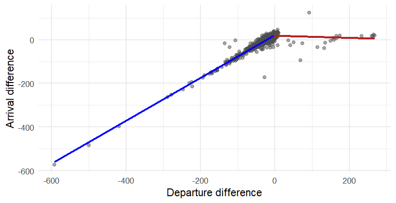

# Vilnius Airport (VNO) Flight Delay & Punctuality Analysis

An exploratory and predictive analysis of arrival flights landing at Vilnius Airport (VNO) between **July 2 and July 25**. This project combines Excel pivot tables and R statistical modeling to evaluate airline punctuality, operational delay patterns across hours and weekdays, and the relationship between departure and arrival delays. 

---

## Project Overview
Flight disruptions cascade through airport operations and passenger schedules. Analyzing three weeks of peak summer traffic at VNO, this project aims to:
- Analyse punctuality rates between airlines that operate in VNO airport.
- Analyse punctuality rates between weekdays and hours.
- Find a mathematical model that can be used to explain arrival differences.

---
## Extraction and data cleaning
The data for the flights was extracted from FlightRadar24 website using python. After the extraction, some columns were removed and the scheduled arrival date and time column was split into 2 columns. Based on actual landing and scheduled time, the difference column was calculated. From Flightera website departure differences were taken and were added into another column. Duplicates where removed.

---
## Summary Findings

### Punctuality index by Airline
* **Selection:** to prevent small sample bias (where carriers with only a few flights distort percentages), only airlines operating at least 30 flights to VNO during the analysis window were included.
* **Most Punctual:** **SAS** leads performance with **91.67%** on-time arrivals (8.33% delayed), followed closely by **Turkish Airlines** (**88.64%** on-time) and **GetJet Airlines** (**87.80%** on-time).
* **Highest Delay Rates:** **airBaltic** experienced the highest proportion of late arrivals at **32.65%** delayed (67.35% on-time), followed by **LOT Polish Airlines** at **26.92%** delayed.

| Airline | Delayed (%) | On-Time (%) |
| :--- | :---: | :---: |
| **SAS** | 8.33% | 91.67% |
| **Turkish Airlines** | 11.36% | 88.64% |
| **Wizz Air** | 12.17% | 87.83% |
| **GetJet Airlines** | 12.20% | 87.80% |
| **Lufthansa** | 12.50% | 87.50% |
| **Heston Airlines** | 13.64% | 86.36% |
| **Ryanair** | 16.04% | 83.96% |
| **Eurowings** | 21.62% | 78.38% |
| **Finnair** | 22.58% | 77.42% |
| **LOT** | 26.92% | 73.08% |
| **airBaltic** | 32.65% | 67.35% |

---

### Punctuality index by week
  * **Best Days:** **Tuesday** (**14.29%** delayed) and **Wednesday** (**15.73%** delayed) exhibit the cleanest operational flow.
  * **Worst Days:** **Thursday** (**25.68%** delayed) and **Friday** (**24.03%** delayed) show the highest accumulation of late arrivals heading into the weekend.

| Weekday | Delayed (%) | On-Time (%) |
| :--- | :---: | :---: |
| **Tuesday** | 14.29% | 85.71% |
| **Wednesday** | 15.73% | 84.27% |
| **Monday** | 15.82% | 84.18% |
| **Sunday** | 20.90% | 79.10% |
| **Saturday** | 22.65% | 77.35% |
| **Friday** | 24.03% | 75.97% |
| **Thursday** | 25.68% | 74.32% |

### Punctuality index by hour
  * **Selection:** similar to the airline analysis, only hourly arrival slots with at least 30 flights were included to avoid small sample distortion.
  * **Most punctual Hours:** mid-day and early morning slots lead performance, peaking at **12:00** (**4.67%** delayed) and **08:00** (**6.90%** delayed).
  * **Most delayed Hours:** highest delay rates happen at night time at **02:00** (**60.00%** delayed), **01:00** (**39.58%** delayed), and **21:00** (**31.51%** delayed).

| Hour | Delayed (%) | On-Time (%) |
| :---: | :---: | :---: |
| **12** | 4.67% | 95.33% |
| **8** | 6.90% | 93.10% |
| **9** | 8.33% | 91.67% |
| **16** | 12.70% | 87.30% |
| **20** | 15.00% | 85.00% |
| **13** | 15.65% | 84.35% |
| **10** | 16.67% | 83.33% |
| **18** | 20.20% | 79.80% |
| **11** | 20.31% | 79.69% |
| **0** | 20.73% | 79.27% |
| **23** | 21.98% | 78.02% |
| **15** | 22.22% | 77.78% |
| **17** | 23.08% | 76.92% |
| **14** | 25.49% | 74.51% |
| **19** | 25.88% | 74.12% |
| **22** | 27.03% | 72.97% |
| **21** | 31.51% | 68.49% |
| **1** | 39.58% | 60.42% |
| **2** | 60.00% | 40.00% |

---

## Difference modeling

The arrival difference in this project is the subtraction of the scheduled arrival time minus the actual landing time. The difference is measured in minutes.

Multiple attempts were made to construct a model explaining arrival differences before arriving at the final approach, though many proved unsuccessful. Initial models evaluated origin airport attributes, specifically investigating the relationship between arrival difference medians and origin airport passenger volumes, geographic distance to VNO, and airport land area. However, each of these airport-level regression models proved statistically insignificant ($p > 0.05$). Another model examined the relationship between aircraft passenger capacity and the arrival difference medians for each aircraft model. While this model was statistically significant ($p < 0.05$), its explanatory power was minimal ($R^2 < 0.1$). Additionally, the $\beta_1$ coefficient was positive, which implies that larger aircraft passenger capacities correlated with earlier arrivals. Consequently, the analysis shifted to evaluate the relationship between departure differences and arrival differences.

Figure 1. Scatterplot of departure differences and arrival differences alongside piecewise regression model line.  

A piecewise linear regression analysis modeled the relationship between **Departure Difference ($x$)** and **Arrival Difference ($y$)**:

$$R^2 = 0.91$$

$$y = \begin{cases} 21.29 + 0.98x, & x < -2.789 \\ 
                    18.47 - 0.05x, & x \ge -2.789 \end{cases}$$

* **Model Explanation:**
  * **When $x < -2.789$ (Delayed Departures):** the slope coefficient ($\approx 0.978$) is close to $1$. This indicates a nearly $1:1$ linear propagation - every additional minute of departure delay results in approximately one minute of arrival delay. Aircraft cannot easily make up significant lost time once delayed on the ground.
  * **When $x \ge -2.789$ (Early Departures):** the slope drops to a near-zero slightly negative coefficient ($\approx -0.05$). This happens because Air traffic control (ATC), slot restrictions, and gate availability prevent flights from landing very early.

* **Problems with the model**
  * Linear regression models have to meet Gauss-Markov assumptions: residuals should be distributed normally with mean 0 and constant variance (homoskedasticity) and have to be independent. Residuals autocorrelated therefore the model written before is a GLS (Generalised Least Squares) model which assumes that residuals can be autocorrelated. More information about the model creation process can be found in the *arrivals.R* file.
 
 ---
  
## Conclusions
- **Departure Delay Propagation:** departure delay is the primary driver of arrival delays ($R^2 = 0.91$). Ground delays propagate almost entirely to arrival times with virtually no capability to recover time in-flight.
- **Asymmetric Buffer Constraints:** early departures do not lead to significantly early arrivals. It happens because of slot restrictions, gate availability, etc.
- **Temporal Congestion:** operational delays peak during late-night and early-morning slots (**01:00-02:00**), as well as late-week operations (**Thursday-Friday**). Mid-week days (**Tuesday-Wednesday**) and morning slots (**08:00-12:00**) present the lowest delay rates at VNO.
- **Airline Punctuality Rates:** every airline that has operated at least 30 flights with VNO airport as destination has a more than 50% punctuality rate. SAS airline holds the highest 91.67% punctuality rate.
---

## Used tools
- **Excel:** for the creation of pivot tables and linear models
- **R**: to create the final linear model and check if it meets Gauss-Markov assumptions.
- **Python**: for the extraction of data.
